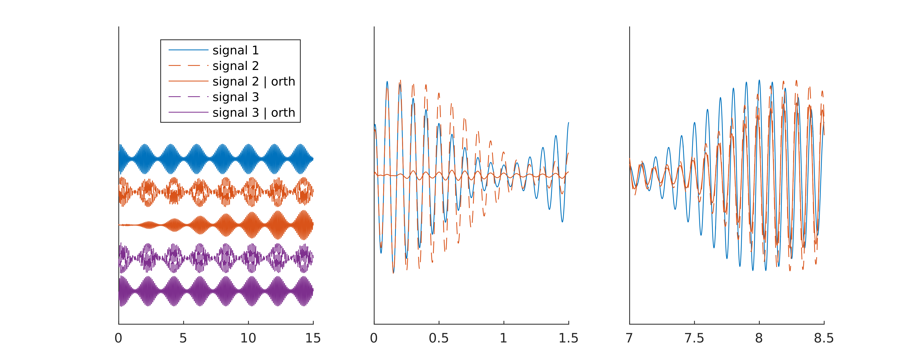
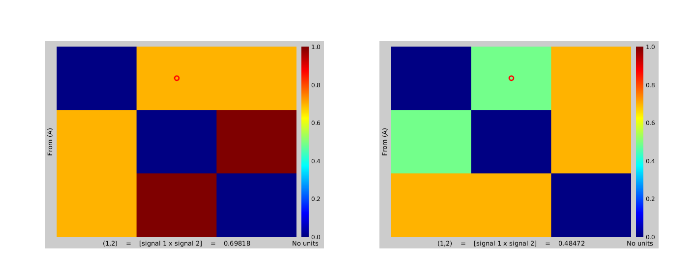
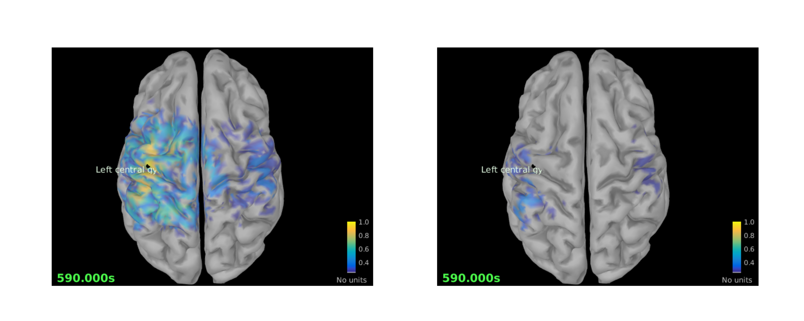

# Amplitude envelope correlation (AEC) - example scripts

**tests_aec_sim.m** simulates three time-series: signal 1 is considered the reference. The envelopes of signals 2 and 3 are correlated with signal 1's envelope at r=.7; signals 1 and 3 have a phase difference of 90deg, whereas the phase difference between 1 and 2 procedes from 0 to 90deg over the length of the signal. Thus the procedure of orthogonalizing decreases correlations between 1 and 2, but leaves the correlation between 1 and 3 unaffected.

Here are the time-series:

And here are the correlation matrices, before and after orthogonalizing:

**tests_aec_omega.m** is run on the protocol generated by the [OMEGA tutorial](http://neuroimage.usc.edu/brainstorm/Tutorials/RestingOmega). It computes the AEC between a seed voxel in the left central gyrus with the rest of the brain. When orthogonalizing the time-series before AEC computation, correlation values directly around the seed region decrease. What's left are correlations that cannot be due to (zero-lag) fieldspread. Note that if there is physiological zero-lag correlations, these will also be discarded by this method.

Here are the AEC maps, thresholded at r=.3, before and after orthogonalizing:

Related literature:

Hipp, Joerg F., et al. "Large-scale cortical correlation structure of spontaneous oscillatory activity." Nature neuroscience 15.6 (2012): 884-890.

Brookes, Matthew J., et al. "Measuring functional connectivity using MEG: methodology and comparison with fcMRI." Neuroimage 56.3 (2011): 1082-1104.
